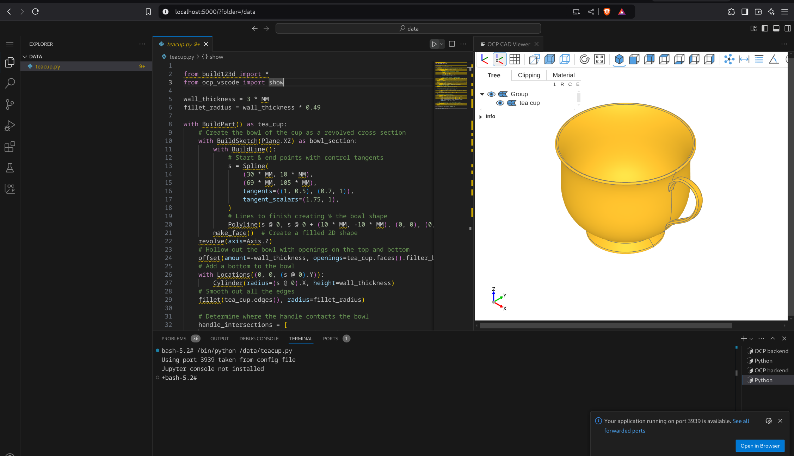

# docker-build123d

Build123d Dev environment (VSCode + OCP-Viewer) in Browser


# Quick Start

## Using Docker

`docker create --name build123d ghcr.io/ankurvdev/vscode-build123d:main -v ./sample:/data`

## Using Podman (Rootless container)

`podman create --name build123d ghcr.io/ankurvdev/vscode-build123d:main -v ./sample:/data`

The website can be accessed via http://localhost:5000

## Docker compose

```
version: "3"
services:
  build123d:
    image: ghcr.io/ankurvdev/vscode-build123d:main
    restart: unless-stopped
    ports:
      - 5000:8080
    volumes:
      - ./sample:/data
```
